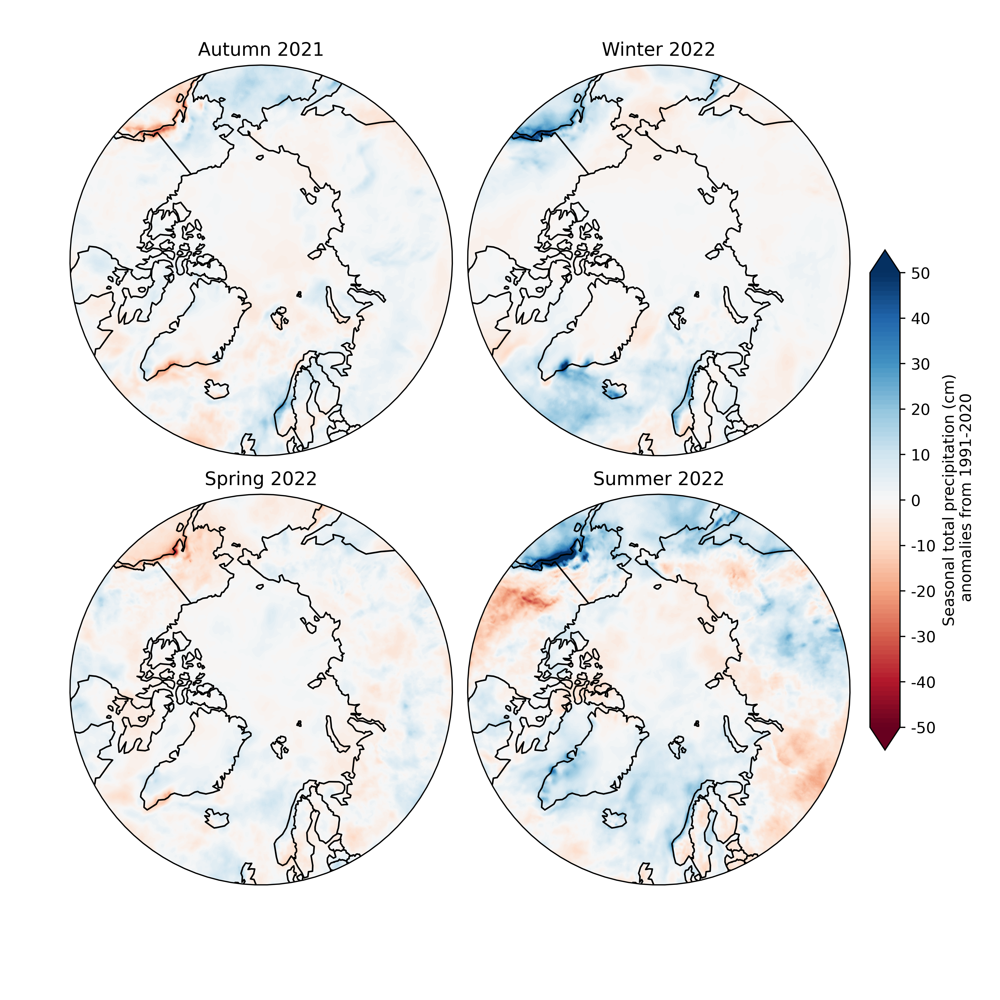
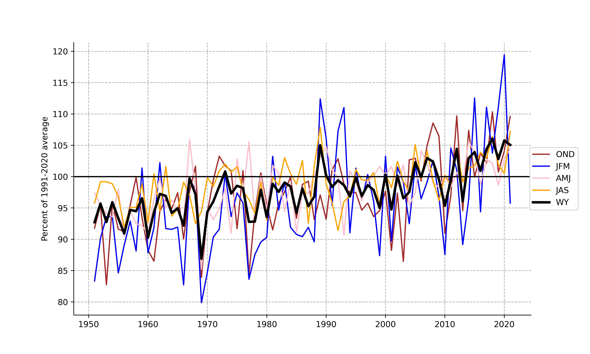

# Arctic Report Card 2022 -- Precipitation Chapter 
***

## Figure 1: 2022 precipitation seasonal anomalies from 1991-2020 average
ERA5 Seasonal departures of precipitation from the 1991-2020 climatological means for autumn 2021 (OND), winter 2022 (JFM), spring 2022 (AMJ) and summer 2022 (JAS). 
''' fig1.era5.2022anomalies.py '''

## Figure 2: Time series of WY 2022 precipitation percent change from 1991-2020
ERA5 time series of October-September water years annual total as percentrage of the 1991-2020 average over 60-90N. Time series totals are used in another figure with GPCC annual totals (script not in this repository).
''' fig2.era5.precip%from1991-2020.py'''

## Figure 3: Precipitation trend from 1950-2022
Seasonal precipitation trends (cm/year) from ERA5 reanalysis with significance at 0.05 level shown.
'''fig3.era5.precipitation.1950-2022.py'''

Script for calculating trend:
'''calc.trend.era5.precipitation.1950-2022.py'''

